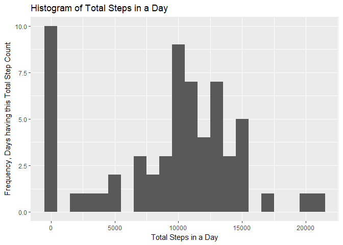
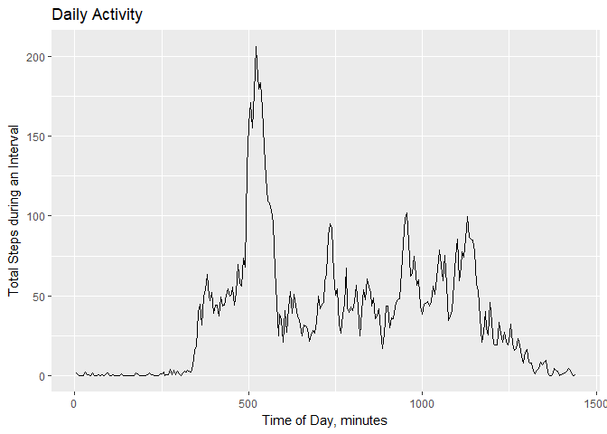

## Loading and preprocessing the data

```r
library(dplyr)
```

```
## Warning: package 'dplyr' was built under R version 3.5.1
```

```
## 
## Attaching package: 'dplyr'
```

```
## The following objects are masked from 'package:stats':
## 
##     filter, lag
```

```
## The following objects are masked from 'package:base':
## 
##     intersect, setdiff, setequal, union
```

```r
library(ggplot2)
actdata <- read.csv("../data/activity.csv")
```


## What is mean total number of steps taken per day?
The total number of steps each day is calculated.
Report the summary of the daily totals


```r
#The total number of steps each day is calculated.
sm0<- with(actdata, tapply(steps,date,sum, na.rm=TRUE))
sumsdf<-data.frame(sm0)
names(sumsdf)<- c("sums")
c<-ggplot(sumsdf, aes(sums))
d<- c+ geom_histogram(binwidth = 1000)
d<- d+ labs(x= "Total Steps in a Day")
d<- d+ labs(y= "Count of Days")
d<- d+ labs(title= "Histogram of Total Steps in a Day")
print(d)
```

<!-- -->

```r
# report the summary of the daily totals
summary(sumsdf)
```

```
##       sums      
##  Min.   :    0  
##  1st Qu.: 6778  
##  Median :10395  
##  Mean   : 9354  
##  3rd Qu.:12811  
##  Max.   :21194
```

```r
print(c("mean: ", mean(sumsdf$sums)))
```

```
## [1] "mean: "           "9354.22950819672"
```

```r
print(c("median: ",median(sumsdf$sums)))
```

```
## [1] "median: " "10395"
```

## What is the average daily activity pattern?
Sum the number of steps at each 5-minute interval across all days to see high activity periods.
Make a time series plot of the 5-minute interval (x-axis)
and the average number of steps taken, averaged across all days (y-axis).

```r
#The steps per 5-minute interval are calculated.
sm1<- with(actdata, tapply(steps,interval,sum, na.rm=TRUE))
intsdf<-data.frame(sm1)
names(intsdf)<- c("sums")
intsdf<- mutate(intsdf,minutes = 5*(1:nrow(intsdf)),interval = as.numeric(rownames(intsdf)))
```

```
## Warning: package 'bindrcpp' was built under R version 3.5.1
```

```r
c<-ggplot(intsdf, aes(minutes,sums))
d<- c+ geom_line()
d<- d+ labs(x= "Time of Day, minutes")
d<- d+ labs(y= "Total Steps during an Interval")
d<- d+ labs(title= "Daily Activity")
print(d)
```

<!-- -->

```r
maxmin<-with(intsdf, intsdf[which(sums == max(sums)),2])
maxint<-with(intsdf, intsdf[which(sums == max(sums)),3])
```
The 5-minute interval where the maximum average number of steps are taken is 835, (520 minutes).

## Imputing missing values
The presence of missing days may introduce bias into some
calculations or summaries of the data.  
1. Calculate and report the total number of missing values in the dataset
(i.e. the total number of rows with NAs).

```r
sumNAs <-sum(is.na(actdata$steps))
meanNAs<-mean(is.na(actdata$steps))
perNAs<- meanNAs*100
```
Answer: The total number of missing step values is: 2304.  
This is 13.1147541% of the values in the dataset.

2. Devise a strategy for filling in all of the missing values in the dataset. The
strategy does not need to be sophisticated. For example, you could use
the mean/median for that day, or the mean for that 5-minute interval, etc.

```r
sm2<- with(actdata, tapply(steps,interval,mean, na.rm=TRUE))
fsdf<-data.frame(sm2)
names(fsdf)<- c("means")
fsdf<- mutate(fsdf,interval = as.numeric(rownames(fsdf)))
```
3. Create a new dataset that is equal to the original dataset but with the
missing data filled in

```r
actdata<- mutate(actdata,needFill=is.na(actdata$steps), filled=actdata$steps)
for(i in 1:nrow(actdata)){
  if(actdata$needFill[i]==TRUE){
     actdata$filled[i] <- fsdf$means[fsdf$interval==actdata$interval[i]]
  }
}
```
4. Make a histogram of the total number of steps taken each day and Calculate
and report the mean and median total number of steps taken per day. Do
these values differ from the estimates from the first part of the assignment?
What is the impact of imputing missing data on the estimates of the total
daily number of steps?


```r
#The total number of steps each day is calculated.
sm3<- with(actdata, tapply(filled,date,sum, na.rm=TRUE))
sumsdf<-data.frame(sm3)
names(sumsdf)<- c("sums")
c<-ggplot(sumsdf, aes(sums))
d<- c+ geom_histogram(binwidth = 1000)
d<- d+ labs(x= "Total Steps in a Day")
d<- d+ labs(y= "Count of Days")
d<- d+ labs(title= "Histogram of Total Steps in a Day (NAs replaced with Interval Mean Value")
print(d)
```

<!-- -->

```r
# report the summary of the daily totals
summary(sumsdf)
```

```
##       sums      
##  Min.   :   41  
##  1st Qu.: 9819  
##  Median :10766  
##  Mean   :10766  
##  3rd Qu.:12811  
##  Max.   :21194
```

```r
print(c("mean: ", mean(sumsdf$sums)))
```

```
## [1] "mean: "           "10766.1886792453"
```

```r
print(c("median: ",median(sumsdf$sums)))
```

```
## [1] "median: "         "10766.1886792453"
```
## Are there differences in activity patterns between weekdays and weekends?
